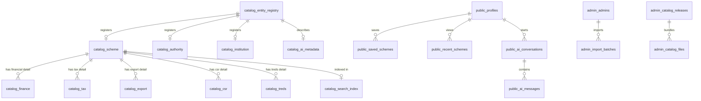

# Supabase Database Architecture & Technical Reference (v2.0)

> **Generated:** 2026-08-05  
> **Database Engine:** PostgreSQL (Supabase)  
> **Architecture Scope:** Hybrid Relational + JSONB Offline-Sync

---

## 1. Executive Summary & Design Principles

The **IN Schemes** database is organized to support citizen scheme searches and administrative governance. With the v2.0 architecture, the system operates on the following core principles:

1. **Schema Partitioning:**
   - `catalog`: Contains all government catalog data, structured for offline compilation and search optimization.
   - `public`: Stores client/user application state (profiles, saved items, chat histories).
   - `admin`: Manages publishing workflows, translations, change audits, and RBAC security.
   - `private`: Secure internal database utilities, membership scopes, and audits.
2. **Hybrid Relational + JSONB Catalog Data:**
   - To combine the flexibility of document-oriented schemas with high-performance querying, catalog tables store the full canonical document in a `record_json` column.
   - Critical search and filter parameters (e.g. `name_en`, `name_ta`, `government_level`, `max_funding_amount`) are mirrored in indexed relational columns.
3. **Triggerless Serialization:**
   - Compilation and serialization are handled asynchronously by an application-level **Catalog Service**, keeping the database fast and free of complex lock conditions.

---

## 2. Entity-Relationship Diagram (ERD)

---

## 3. Comprehensive Schema & Table Specifications

### 3.1. `catalog` Schema

#### Table: `catalog.entity_registry`
* **Description:** Global index of all catalog items across all categories for validation, tracking, and soft-deletes.
* **Columns:**
  - `entity_id` `TEXT` (PK) - Stable ID.
  - `entity_type` `TEXT` - e.g. `'scheme'`, `'authority'`, `'institution'`.
  - `catalog_name` `TEXT` - e.g. `'scheme_catalog'`.
  - `current_version` `TEXT` - Record version.
  - `status` `TEXT` - `'DRAFT'`, `'READY_FOR_REVIEW'`, `'REVIEWED'`, `'APPROVED'`, `'PUBLISHED'`, `'ARCHIVED'`.
  - `validation_status` `TEXT` - `'PASSED'`, `'FAILED'`, `'WARNING'`, `'NOT_VALIDATED'`.
  - `is_deleted` `BOOLEAN`.
  - `deleted_at` `TIMESTAMPTZ`.
  - `deleted_reason` `TEXT`.
  - `updated_at` `TIMESTAMPTZ`.

#### Table: `catalog.scheme`
* **Description:** Government financial and assistance support schemes master database.
* **Relational Columns:**
  - `scheme_code` `TEXT` (Unique) - Reference code (e.g. `'IN001'`).
  - `name_en` `TEXT` - English scheme name.
  - `name_ta` `TEXT` - Tamil scheme name.
  - `government_level` `TEXT` - e.g. Central / State / District.
  - `ministry` `TEXT` - UNION Ministry name.
  - `department` `TEXT` - Issuing department.
  - `state` `TEXT` - Target geographic state.
  - `scheme_type` `TEXT` - e.g. Grant / Subsidy / Loan.
  - `max_funding_amount` `NUMERIC(15,2)`.
  - `minimum_funding_amount` `NUMERIC(15,2)`.
  - `is_active` `BOOLEAN` - Match availability indicator.
  - `search_keywords` `TEXT`.

#### Table: `catalog.authority`
* **Description:** Administrative and government ministries or state-level overseeing bodies.
* **Columns:**
  - `code` `TEXT` (Unique) - Authority unique code.
  - `name_en` `TEXT`.
  - `name_ta` `TEXT`.

#### Table: `catalog.institution`
* **Description:** Specific implementing bodies or departments (e.g., SIDBI, NABARD).
* **Columns:**
  - `code` `TEXT` (Unique).
  - `name_en` `TEXT`.
  - `name_ta` `TEXT`.
  - `authority_id` `TEXT` (FK -> `catalog.authority(id)`).

#### Table: `catalog.finance`
* **Description:** Detail finance structures and credit incentives mapping to schemes.
* **Columns:**
  - `scheme_id` `TEXT` (FK -> `catalog.scheme(id)`).
  - `interest_subvention_rate` `NUMERIC(5,2)`.
  - `max_loan_amount` `NUMERIC(15,2)`.

#### Table: `catalog.tax`
* **Description:** Direct/indirect tax exemptions and subventions.
* **Columns:**
  - `scheme_id` `TEXT` (FK -> `catalog.scheme(id)`).
  - `exemption_percentage` `NUMERIC(5,2)`.

#### Table: `catalog.export`
* **Description:** Export subsidies, duty-drawbacks, and international trade assistance.
* **Columns:**
  - `scheme_id` `TEXT` (FK -> `catalog.scheme(id)`).
  - `target_countries` `TEXT[]`.

#### Table: `catalog.csr`
* **Description:** Corporate Social Responsibility grants and focus areas.
* **Columns:**
  - `scheme_id` `TEXT` (FK -> `catalog.scheme(id)`).
  - `focus_areas` `TEXT[]`.

#### Table: `catalog.treds`
* **Description:** Platform mappings for Trade Receivables Discounting System.
* **Columns:**
  - `scheme_id` `TEXT` (FK -> `catalog.scheme(id)`).
  - `interest_rate_range` `TEXT`.

#### Table: `catalog.search_index`
* **Description:** Content text chunks alongside 1536-dimensional embeddings.
* **Columns:**
  - `scheme_id` `TEXT` (Unique FK -> `catalog.scheme(id)`).
  - `content` `TEXT`.
  - `embedding` `extensions.vector(1536)` - OpenAI vectors.

#### Table: `catalog.relationships`
* **Description:** Dynamic, typed dependency graph mapping between registry entities.
* **Columns:**
  - `id` `UUID`.
  - `source_type` `TEXT`.
  - `source_id` `TEXT`.
  - `target_type` `TEXT`.
  - `target_id` `TEXT`.
  - `relationship_type` `TEXT` - e.g. `'depends_on'`, `'requires_service'`.

#### Table: `catalog.ai_metadata`
* **Description:** AI-generated metadata, translations, and summaries.
* **Columns:**
  - `entity_id` `TEXT` (PK -> `catalog.entity_registry(entity_id)`).
  - `summary_en` `TEXT`.
  - `summary_ta` `TEXT`.
  - `keywords` `TEXT[]`.
  - `embedding_status` `TEXT`.
  - `approved` `BOOLEAN`.

---

### 3.2. `public` Schema

#### Table: `public.profiles`
* **Description:** Individual user account preferences and demographics.

#### Table: `public.startup_profiles`
* **Description:** Venture details, sector, development stage, and target requirements.

#### Table: `public.saved_schemes`
* **Description:** Citizen user favorites list mapping to `catalog.scheme(id)`.

#### Table: `public.recent_schemes`
* **Description:** Audit-log of recently viewed schemes.

#### Table: `public.ai_conversations` / `public.ai_messages`
* **Description:** Thread and message records for natural language search helpers.

#### Table: `public.sync_history`
* **Description:** Synchronization logs submitted by client apps.
* **Columns:**
  - `id` `UUID`.
  - `user_id` `UUID` (FK -> `public.profiles(id)`).
  - `device_id` `TEXT`.
  - `platform` `TEXT`.
  - `previous_release_version` `BIGINT`.
  - `synced_release_version` `BIGINT`.
  - `status` `TEXT` - `'SUCCESS'`, `'FAILED'`.
  - `error_message` `TEXT`.
  - `duration_ms` `INTEGER`.

---

### 3.3. `admin` Schema

#### Table: `admin.roles` / `admin.admins`
* **Description:** Role-Based Access Control (RBAC) mapping staff members to scopes.

#### Table: `admin.import_batches`
* **Description:** Logs catalog import operations (e.g., JSON imports from LLMs/Claude).

#### Table: `admin.catalog_releases`
* **Description:** Immutable release manifestations targeting specific app schema versions.

#### Table: `admin.catalog_files`
* **Description:** Specific catalog parts (e.g. `scheme_catalog.json`) generated in a release, tracking compression and mime types.

#### Table: `admin.translation_jobs` / `admin.translation_memory`
* **Description:** Asynchronous localization tasks and translation memories for high-speed catalog localization.

#### Table: `admin.record_locks`
* **Description:** CMS lockouts preventing admins from overwriting concurrent edits.

#### Table: `admin.job_queue`
* **Description:** Generic background execution queue.

#### Table: `admin.event_log`
* **Description:** Audit ledger tracking administrative updates.
