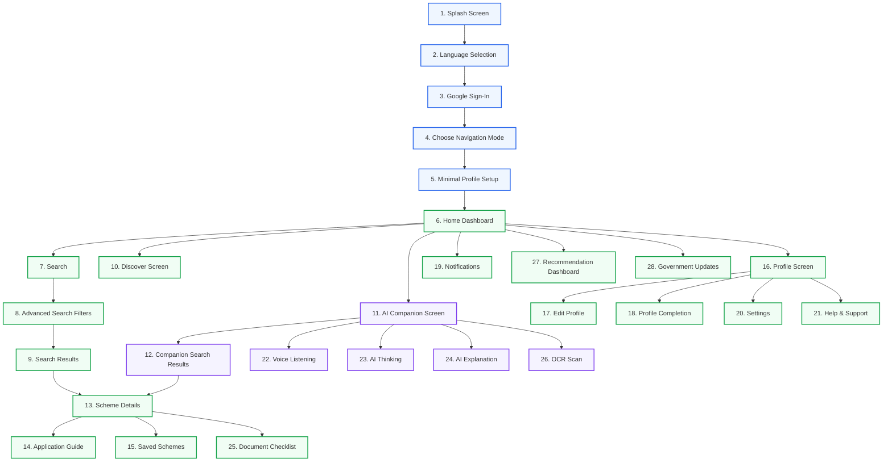

# 📱 IN Schemes: UX & Screen Architecture Specification

This document details the comprehensive user experience design, screen architecture, and navigation flow of the **IN Schemes** platform.

---

## 🗺️ Visual User Journey

Below is the flowchart representing the user onboarding, navigation modes, and screen connections:

---

## 🚀 1. Authentication & Onboarding Flow

### 1. Splash Screen
*   **Logo:** High-definition branding icon.
*   **AI Initialization:** Asynchronous loading of recommendation models and cache.
*   **Session Check:** Verifies secure token storage to bypass login for returning users.
*   **Loading Animation:** Fluid micro-animation signaling start state.

### 2. Language Selection
*   **Supported:** English, Tamil (தமிழ்).
*   **Planned/Future:** Hindi, Telugu, Kannada, Malayalam.
*   **Companion Language Preview:** Interactive preview of the AI voice in the chosen language.

### 3. Google Sign-In
*   **Action:** Secure OAuth authentication via "Continue with Google".
*   **Legal Disclaimers:** Visible links to the **Privacy Notice** and **Terms & Conditions**.

### 4. Choose Navigation Mode ⭐
Users select their interface configuration:
*   **Regular Navigation:** Traditional, visual app experience with the AI available on demand.
*   **Companion Navigation:** Guided, voice-first experience with persistent, context-aware assistance.

### 5. Minimal Profile Setup
Collects essential criteria for initial recommendation matching:
*   Name
*   State
*   District
*   Occupation / Business Stage
*   Industry (Optional)

---

## 🏠 2. Main Application Hub

### 6. Home Dashboard
The central landing point featuring:
*   **Greeting:** Personalized welcome header.
*   **Search Bar:** Direct access to keyword search.
*   **AI Companion Card:** Quick-launch trigger for the conversational assistant.
*   **Profile Completion Card:** Progressive indicator prompting updates for greater matching accuracy.
*   **Recommended Schemes:** Scrollable carousel of highly compatible options.
*   **Government Updates:** Live announcements feed.
*   **Quick Actions & Recently Viewed:** Direct links to common workflows and historical views.
*   **Saved Schemes Preview:** Quick view of bookmarked options.

### 7. Search Screen
*   **Input Area:** Text search field with a voice dictation widget.
*   **Suggested Searches:** Contextual search recommendations.
*   **History:** Recents and popular search queries.
*   **Companion Search Trigger:** Instantly translates query text to start an assistant dialogue.

### 8. Advanced Search Filters
A detailed bottom-sheet panel containing:
*   State & District
*   Scheme Category (e.g. MSME, Student)
*   Sponsoring Ministry & Department
*   Applicant demographics (Community, Income, Gender, Occupation)
*   Scheme Type (Subsidy, Grant, Loan) & Application Mode (Online, Offline)

### 9. Search Results Screen
*   **Overview:** Match count indicator, sort controls (Score, Date, Alphabetical), and active filter chips.
*   **Interaction:** Match score indicators, bookmarking, and native sharing.
*   **Performance:** Infinite scrolling list view.

---

## 🔍 3. Discover Section

### 10. Discover Screen
Replaces traditional static listings with segmented discovery channels:
*   **Trending & Newly Launched**
*   **Target Demographics:** Scholarships, Agriculture, MSME, Women, Students, Senior Citizens.
*   **Business Verticals:** Startups, Business, Skill Development.
*   **Welfare Areas:** Healthcare, Housing.
*   **Navigation Nodes:** Browse by Life Events, Browse by Occupation, Browse by Ministry.

---

## 🤖 4. AI Companion Ecosystem

### 11. Companion Screen
An immersive assistant page supporting:
*   **Voice Conversation:** Direct voice interactions.
*   **Text Chat:** Standard keyboard text inputs.
*   **Quick Suggestions:** Contextual prompts (e.g., "What schemes match agriculture?").
*   **Recent Conversations:** Conversation history.
*   **OCR Integration:** Launches camera scan to extract profile details from documents.

### 12. Companion Search Results
A conversational recommendation view including:
*   **Explanation:** Narrative explanation of "Why these schemes match your profile".
*   **Context:** History of questions asked during the conversation.
*   **Confidence Score:** Graphic match confidence indicator.
*   **Ranked List:** Top recommended schemes.

---

## 📄 5. Scheme Details & Guides

### 13. Scheme Details
An Amazon-style details page featuring:
*   **Hero Banner:** Graphic header displaying the scheme's core category.
*   **Match Score & Explainability:** "Why You Qualify" breakdown box.
*   **Benefits:** Financial, subsidy, or training details.
*   **Eligibility Details & Document Checklists**
*   **Application Process & FAQs**
*   **Reviews & Community Feedback** (Future phase)
*   **Footer Actions:** Save, Share, and Apply Now triggers.

### 14. Application Guide
A step-by-step checklist guide to submission:
*   Required documents collection status.
*   Portal links & offline office addresses.
*   Detailed progress tracker.

---

## ❤️ 6. Saved & Bookmarks

### 15. Saved Schemes
*   **Bookmarked:** User-pinned schemes.
*   **Downloaded:** Offline-cached scheme documents.
*   **Recently Viewed:** Complete history tracker.

---

## 👤 7. Profile & Completion

### 16. Profile Screen
Main user account hub linking to:
*   User Details Card
*   Eligibility Profile Editor
*   Language Preference
*   Navigation Mode Selector
*   Saved Schemes, Settings, Support, and Logout Actions

### 17. Edit Profile Screen
Detailed forms grouped by category:
*   Personal Details & Location
*   Occupation & Education
*   Income & Community
*   Business Details

### 18. Profile Completion Flow
Progressive wizard questions that prompt users for incremental attributes to improve match quality instead of asking for all details up front:
*   *Add Income* ➔ *Add Community* ➔ *Add Aadhaar* ➔ *Add Disability*

---

## 🔔 8. Notifications Hub

### 19. Notifications Screen
Separated feed for updates:
*   **New Schemes:** Notifications of newly seeded items matching user criteria.
*   **Deadlines:** Application closing reminders.
*   **Updates:** Department policy shifts or subsidy increments.
*   **System:** Profile completion alerts.

---

## ⚙️ 9. Settings

### 20. Settings Screen
*   Language and Notification preferences.
*   App Theme (Dark Mode) toggle.
*   Navigation Mode (Regular/Companion) selector.
*   Companion Voice settings.
*   Privacy Policy, Terms of Service, and Delete Account triggers.

---

## ⚙️ 10. Help & Support

### 21. Help & Support Screen
*   Frequently Asked Questions.
*   Quick Contact Channels: **Email Support** (`support@inschemes.gov.in`) and **Phone Support** (`1800 123 4567`).
*   **Report an Issue / Feedback Form:** Launches interactive ticketing and rating sheets.

---

## 🤖 11. Companion Specific Screens

### 22. Voice Listening
An active audio input page showing:
*   Animated waveform visualization.
*   Listening state status.
*   Cancel action button.

### 23. AI Thinking
*   Animated Companion character state.
*   "Generating recommendations..." loader.

### 24. AI Explanation
*   Detail card explaining matching rules.
*   Highlighting of missing requirements and next steps.

---

## 📂 12. Documents & OCR

### 25. Document Checklist
*   List of required documents mapped by state.
*   Divided into **Completed**, **Missing**, and **Upload Later**.

### 26. OCR Scan Screen
*   Camera frame interface.
*   Cropping bounds overlay.
*   Auto-extraction of profile details for form autofill.

---

## 📊 13. Recommendation Dashboard

### 27. Recommendation Dashboard
An analytics dashboard showing:
*   Overall eligibility percentage.
*   Total matching schemes count.
*   Required pending information and missing documents.
*   Overall profile strength score.

---

## 🌐 14. Government Updates Feed

### 28. Government Updates Screen
*   Latest Central & State government scheme updates.
*   Live announcements feed and upcoming deadlines list.

---

## 🧩 15. Utility Screens

### 29. Empty State
*   Polished visual assets showing "No results found" with suggestion prompts.

### 30. No Internet
*   Offline state handler with retry buttons.

### 31. Error Page
*   Polished error boundary with detailed logs and diagnostic helpers.

### 32. Loading Skeleton
*   Content-matched skeleton UI grids and list bars.

### 33. Permission Request
*   Pre-request dialogue cards for Camera, Microphone, and Notification access.
