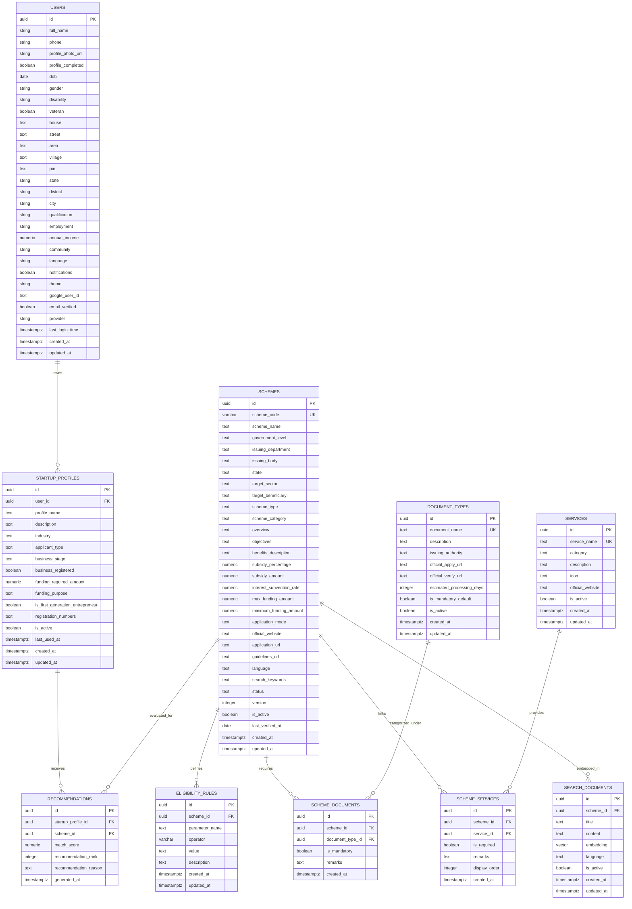

# Database Schema & Architecture

This document provides a comprehensive overview of the database schema, tables, and relationships for the **IN Schemes** backend. The database is hosted on Supabase (PostgreSQL) and utilizes extensions such as `pgvector` for semantic search.

---

## 1. Entity Relationship Diagram (ERD)

---

## 2. Table Reference & Data Dictionary

### 2.1 Users (`public.users`)
Stores application-specific user profiles linked to Supabase Auth (`auth.users`).

| Column Name | Data Type | Constraints | Description |
| :--- | :--- | :--- | :--- |
| `id` | `UUID` | Primary Key, FK to `auth.users` | Unique identifier linked directly to Supabase Auth. |
| `full_name` | `TEXT` | NOT NULL | User's full name. |
| `phone` | `VARCHAR(20)` | | Contact phone number. |
| `profile_photo_url` | `TEXT` | | URL of the profile avatar. |
| `profile_completed` | `BOOLEAN` | DEFAULT `FALSE` | Indicates whether onboarding profile is complete. |
| `dob` | `DATE` | | Date of birth. |
| `gender` | `VARCHAR(50)` | | Gender (e.g., Male, Female, Other). |
| `disability` | `VARCHAR(100)` | | Disability status or category if applicable. |
| `veteran` | `BOOLEAN` | DEFAULT `FALSE` | Veteran status. |
| `annual_income` | `NUMERIC(15,2)`| DEFAULT `0.0` | User's gross annual income. |
| `community` | `VARCHAR(100)` | | Caste/community category (e.g., General, OBC, SC, ST). |
| `state` | `TEXT` | | Residential state. |
| `city` | `TEXT` | | Residential city. |

### 2.2 Startup Profiles (`public.startup_profiles`)
Stores individual business/startup concepts or profiles created by users for match evaluations.

| Column Name | Data Type | Constraints | Description |
| :--- | :--- | :--- | :--- |
| `id` | `UUID` | Primary Key | Unique profile identifier. |
| `user_id` | `UUID` | NOT NULL, FK to `public.users` | Owner of the startup profile. |
| `profile_name` | `TEXT` | NOT NULL | Friendly name of the startup (e.g., "AgriTech Venture"). |
| `industry` | `TEXT` | NOT NULL | Sector (e.g., Technology, Agriculture, Manufacturing). |
| `applicant_type` | `TEXT` | NOT NULL | Type (e.g., Student, Woman Entrepreneur, MSME). |
| `business_stage` | `TEXT` | NOT NULL | `Idea`, `Prototype`, `Registered`, `Operational`, `Expansion` |
| `funding_required_amount`| `NUMERIC(15,2)`| >= 0 | Estimated funding needed. |
| `is_first_generation_entrepreneur` | `BOOLEAN`| DEFAULT `FALSE` | True if the first entrepreneur in their family. |
| `registration_numbers` | `TEXT` | | GSTIN, Udyam Registration, or other business IDs. |

### 2.3 Schemes (`public.schemes`)
Master catalog of government schemes.

| Column Name | Data Type | Constraints | Description |
| :--- | :--- | :--- | :--- |
| `id` | `UUID` | Primary Key | Unique scheme identifier. |
| `scheme_code` | `VARCHAR(50)` | UNIQUE, NOT NULL | Code identifier (e.g., `NEEDS`, `PMEGP`). |
| `scheme_name` | `TEXT` | NOT NULL | Full name of the scheme. |
| `government_level` | `TEXT` | NOT NULL | Level of issuing body (e.g., `Central`, `State`). |
| `state` | `TEXT` | | State name (if state-specific). |
| `max_funding_amount` | `NUMERIC(15,2)`| | Maximum financial support threshold. |
| `subsidy_percentage` | `NUMERIC(5,2)` | | Percentage of project cost subsidized. |

### 2.4 Eligibility Rules (`public.eligibility_rules`)
Dynamic rules applied during recommendation scoring.

| Column Name | Data Type | Constraints | Description |
| :--- | :--- | :--- | :--- |
| `id` | `UUID` | Primary Key | Unique rule identifier. |
| `scheme_id` | `UUID` | NOT NULL, FK to `public.schemes` | Linked scheme. |
| `parameter_name` | `TEXT` | NOT NULL | Field evaluated (e.g., `state`, `business_stage`). |
| `operator` | `VARCHAR(50)` | NOT NULL | Comparison operator (e.g., `=`, `>`, `IN`). |
| `value` | `TEXT` | NOT NULL | Expected value to match against. |

### 2.5 Search Documents (`public.search_documents`)
Enables semantic search by storing OpenAI embeddings of scheme descriptions.

| Column Name | Data Type | Constraints | Description |
| :--- | :--- | :--- | :--- |
| `id` | `UUID` | Primary Key | Unique search chunk identifier. |
| `scheme_id` | `UUID` | NOT NULL, FK to `public.schemes` | Linked scheme. |
| `content` | `TEXT` | NOT NULL | Plain text representation of the scheme attributes. |
| `embedding` | `VECTOR(1536)` | | pgvector field containing high-dimensional float array. |
